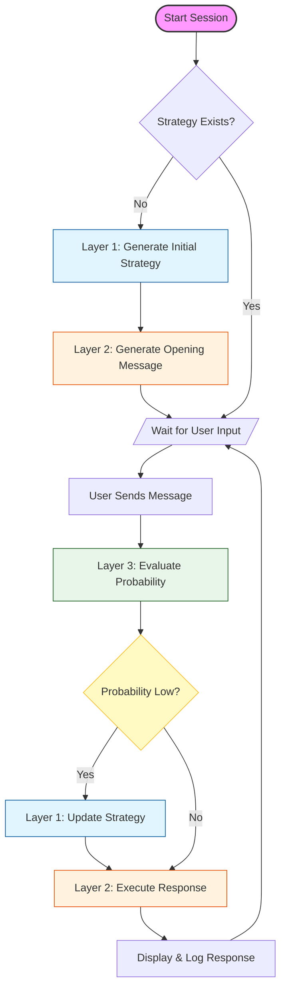

# Collection Agent (Easy Mode)

This project is a sophisticated **Debt Collection Simulation Agent** built with **Streamlit** and **OpenAI**. It demonstrates a multi-agent architecture designed to handle complex negotiation scenarios with dynamic strategy adjustments.

## 🧠 Core Architecture

The system operates using a three-layer agentic workflow:

1.  **Layer 1: Strategy Manager**
    *   Analyzes customer profile and historical logs.
    *   Formulates a "Daily Strategy" to guide the conversation.
    *   Dynamically updates the strategy if the current approach is deemed ineffective.

2.  **Layer 2: Executor**
    *   Acts as the frontline debt collector.
    *   Executes the strategy while strictly adhering to company "Hard Rules" (e.g., no partial payments if prohibited).
    *   Generates responses in Chinese considering the context and tone.

3.  **Layer 3: Evaluator**
    *   Continuously monitors the conversation.
    *   Evaluates the "Probability of Repayment" (High, Medium, Low) after every customer input.
    *   Triggers a strategy update if the probability drops to "Low".

## 🔄 Operational Logic

The following flowchart illustrates the interaction between the user and the three agent layers:



### Logic Breakdown
1.  **Initialization**: At the start, **Layer 1** analyzes the rigid customer history to formulate a high-level strategy. **Layer 2** uses this to "break the ice".
2.  **Monitoring**: Every time the user speaks, **Layer 3** evaluates the situation. It monitors not just *what* is said, but the *implication* on repayment probability.
3.  **Adaptive feedback**:
    *   If the conversation is going well (High/Medium probability), **Layer 2** continues executing the current strategy.
    *   If the user is resistant (Low probability), **Layer 3** signals **Layer 1** to intervene. **Layer 1** then modifies the instructions for **Layer 2** (e.g., "Switch from friendly reminder to strict warning about credit score impact").


## ✨ Key Features

*   **Interactive Chat Interface**: Real-time conversation with the agent.
*   **Transparent "Brain"**: View the agent's internal thought process, strategy formulation, and real-time evaluations in a dedicated sidebar.
*   **Configurable Scenarios**: Load different collection rules and scenarios via YAML configuration files.
*   **Customizable Profiles**: Edit customer profiles and psychological portraits directly in the UI.

## 🚀 Getting Started

### Prerequisites

*   Python 3.8+
*   OpenAI API Key

### Installation

1.  Clone the repository:
    ```bash
    git clone https://github.com/your-username/longmemo.git
    cd longmemo
    ```

2.  Install the required packages:
    ```bash
    pip install streamlit openai pyyaml
    ```

3.  Set up your OpenAI API Key:
    You can set it as an environment variable:
    ```bash
    export OPENAI_API_KEY="sk-..."
    # Optional: Set a custom base URL if needed
    export OPENAI_BASE_URL="https://api.openai.com/v1"
    ```

### Running the Application

Run the Streamlit app:

```bash
streamlit run app_easy.py
```

The application will open in your default browser at `http://localhost:8501`.

## ⚙️ Configuration

The application uses YAML files located in the `configs/` directory to define collection rules. You can select different configurations from the sidebar.

**Example Config Structure:**
*   Company Hard Rules (e.g., Do not accept partial payment).
*   Base System Prompts.
*   Allowed collection actions.

## 📂 Project Structure

*   `app_easy.py`: The main application script containing the multi-agent logic and UI.
*   `configs/`: Directory containing YAML configuration files for different scenarios (e.g., `T0.yaml`, `aggressive_collection.yaml`).
